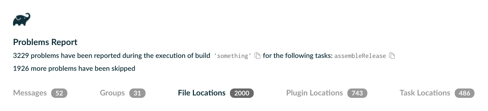

<meta property="og:image" content="https://gradle.org/assets/images/releases/gradle-default.png" />
<meta property="og:type"  content="article" />
<meta property="og:title" content="Gradle @version@ Release Notes" />
<meta property="og:site_name" content="Gradle Release Notes">
<meta property="og:description" content="We are excited to announce Gradle @version@.">
<meta name="twitter:card" content="summary_large_image">
<meta name="twitter:site" content="@gradle">
<meta name="twitter:creator" content="@gradle">
<meta name="twitter:title" content="Gradle @version@ Release Notes">
<meta name="twitter:description" content="We are excited to announce Gradle @version@.">
<meta name="twitter:image" content="https://gradle.org/assets/images/releases/gradle-default.png">

We are excited to announce Gradle @version@ (released [@releaseDate@](https://gradle.org/releases/)).

In this release, the [Isolated Projects](#isolated-projects) performance feature graduates from experimental to incubating, bringing safe parallel project configuration and tools to help you migrate your build.

This release also enhances the [Configuration Cache](#configuration-cache-improvements): `ResolutionResult` can now be included directly as a task input, and source dependencies resolved from version control repositories become fully cache-compatible.

[Test reporting and execution](#test-reporting-and-execution) now surfaces framework-initialization failures for TestNG, JUnit 4, and JUnit Platform in the console by default, and Gradle's `threadPoolFactoryClass` option for TestNG now supports TestNG 7.10 and later.

The [CLI, logging, and problem reporting](#cli-logging-and-problem-reporting) now shows a source location for up to 2050 problems per build, up from 50, so the console, problems report, and Tooling API pinpoint many more issues.

[Build authoring](#build-authoring-improvements) gains a `reproducibleFileTimestamp` property on archive tasks for `SOURCE_DATE_EPOCH`-compatible builds. `ResolvedArtifactResult` also gains new `getAttributes()` and `getCapabilities()` accessors.

For [platform and toolchain management](#platform-and-toolchain-management), `DomainObjectCollection.getElements()` returns a new lazy Provider that bridges the Domain Object Collection and Provider APIs, and `Groovydoc` gains Java-toolchain support.

[Security and infrastructure](#security-and-infrastructure) improvements let dependency verification carry `origin` and `reason` attributes on trusted PGP keys, and report how many other keys you already trust for a failing artifact — making key rotations easier to distinguish from first-time trusts.

Finally, [general improvements](#general-improvements) let file system watching work with a custom project cache directory, and drop Kotlin DSL accessor generation from the Build Cache.

We would like to thank the following community members for their contributions to this release of Gradle:
[Adam](https://github.com/aSemy),
[Aman Gautam](https://github.com/Gautam-aman),
[Aman Kumar](https://github.com/YukiCodepth),
[Aurimas](https://github.com/liutikas),
[gbhavya07](https://github.com/gbhavya07),
[Josh Friend](https://github.com/joshfriend),
[nicklauslittle-gov](https://github.com/nicklauslittle-gov),
[Pragati](https://github.com/psoni674),
[project516](https://github.com/Project516),
[Ravi](https://github.com/rkdfx),
[sk-reddy17](https://github.com/sk-reddy17),
[Suvrat Acharya](https://github.com/Suvrat1629),
[Yongshun Ye](https://github.com/ShreckYe).

Be sure to check out the [public roadmap](https://roadmap.gradle.org) for insight into what's planned for future releases.

## Upgrade instructions

Switch your build to use Gradle @version@ by updating the [wrapper](userguide/gradle_wrapper.html) in your project:

```text
./gradlew :wrapper --gradle-version=@version@ && ./gradlew :wrapper
```

See the [Gradle 9.x upgrade guide](userguide/upgrading_version_9.html#changes_@baseVersion@) to learn about deprecations, breaking changes, and other considerations when upgrading to Gradle @version@.

For Java, Groovy, Kotlin, and Android compatibility, see the [full compatibility notes](userguide/compatibility.html).

## New features and usability improvements

### Isolated Projects
[Isolated Projects](userguide/isolated_projects.html) is a performance feature that safely runs project configuration in parallel, significantly reducing configuration time in many scenarios, including IDE sync and CI builds.

Before running any task, Gradle must complete the [Configuration Phase](userguide/build_lifecycle_intermediate.html). The [Configuration Cache](userguide/configuration_cache.html) lets repeated build invocations skip this phase entirely, but any other invocation configures every project, which is a noticeable cost in large builds. This includes IDE sync, where the Configuration Phase cannot be cached.

Isolated Projects accelerates the Configuration Phase. Today, it does so through parallelism: because each project is configured in isolation, sibling projects can be configured concurrently rather than sequentially. In the future, it will also configure projects incrementally, skipping the phase for any project whose configuration has not changed.


Isolated Projects can be enabled with a new flag `--isolated-projects` on the command line, or in the properties file:

```text
# gradle.properties
org.gradle.isolated-projects=true
```

Enabling Isolated Projects can result in [behavior changes](userguide/isolated_projects.html#sec:behavior_changes); the documentation describes each one and how to avoid it.

Isolated Projects serves as the foundation for future scalability work, allowing for more parallelism and reuse of work in the Configuration Phase.

#### Isolated Projects constraints
To keep builds reliable with added parallelism, project isolation must be enforced via new [constraints](userguide/isolated_projects.html#sec:constraints) applied to the build logic. The core principle is that the configuration logic of a project cannot touch the mutable state of other projects or the build. For instance, calling `project(":other").tasks` or `gradle.extensions` is not allowed. Upon detecting a violation of the constraints, Gradle will fail the build immediately.

Initially, builds may contain many violations, and Isolated Projects includes a [Diagnostics mode](userguide/isolated_projects.html#sec:diagnostics_mode) that lets you discover them without compromising safety.

```text
# gradle.properties
org.gradle.isolated-projects.diagnostics=true
```

During the migration period, it can be useful to relax constraints to evaluate the performance benefit specific to your build. It is possible to dangerously ignore the violations by treating them as warnings:

```text
# gradle.properties
org.gradle.isolated-projects.dangerously-ignore-problems=true
```

Both additional flags require Isolated Projects to be enabled to take effect.

See the [Isolated Projects Constraints](userguide/isolated_projects.html#sec:constraints) chapter in the Gradle User Manual for more details.

#### Isolated Projects is now incubating
In this release, the feature transitions from being experimental to incubating. It is ready for early adopters to try and share feedback.

Follow the [migration](userguide/isolated_projects.html#sec:migration) guide to make your build compatible with Isolated Projects.

The legacy `org.gradle.unsafe.isolated-projects` property names are now deprecated and will be removed in a future release.
They continue to work as aliases for now.

The feature is not enabled by default and is not yet recommended for production use. Your build and plugins will likely need changes to meet the safety [requirements](#isolated-projects-constraints). Compatibility with [Configuration Cache](userguide/configuration_cache.html) is also a prerequisite for Isolated Projects.

See the [Isolated Projects](userguide/isolated_projects.html) documentation in the Gradle User Manual for more details.

### Configuration Cache improvements
Gradle provides a [Configuration Cache](userguide/configuration_cache.html) that improves build time by caching the result of the Configuration Phase and reusing it for subsequent builds.

#### `ResolutionResult` is fully Configuration Cache compatible
A [`ResolutionResult`](javadoc/org/gradle/api/artifacts/result/ResolutionResult.html) may now be included directly as a task input when using Configuration Cache.

This provides easy access to convenience APIs on `ResolutionResult`, avoiding the need to traverse the graph manually to access them.

```kotlin
// Before
abstract class PreviousTask : DefaultTask() {
    @get:Input
    abstract val rootComponent: Property<ResolvedComponentResult>
    @get:Input
    abstract val rootVariant: Property<ResolvedVariantResult>

    @TaskAction
    fun execute() {
        // No access to APIs on ResolutionResult, requiring manual graph traversal.
    }
}

tasks.register<PreviousTask>("before") {
    rootComponent = configurations.runtimeClasspath.flatMap { it.incoming.resolutionResult.rootComponent }
    rootVariant = configurations.runtimeClasspath.flatMap { it.incoming.resolutionResult.rootVariant }
}

// After
abstract class NewTask : DefaultTask() {
    @get:Input
    abstract val resolutionResult: Property<ResolutionResult>

    @TaskAction
    fun traverse() {
        // Access to convenience APIs on ResolutionResult.
        resolutionResult.get().allDependencies
        resolutionResult.get().allComponents
    }
}

tasks.register<NewTask>("after") {
    resolutionResult = configurations.runtimeClasspath.map { it.incoming.resolutionResult }
}
```

Previously, the root [`ResolvedComponentResult`](javadoc/org/gradle/api/artifacts/result/ResolvedComponentResult.html) and [`ResolvedVariantResult`](javadoc/org/gradle/api/artifacts/result/ResolvedVariantResult.html) needed to be extracted and included on the task separately.

#### Third-party Java agents work with the Configuration Cache in TestKit
[TestKit](userguide/test_kit.html) lets plugin authors functionally test their build logic by running real builds with `GradleRunner`.
A common setup attaches a Java agent to the build JVM, for example the JaCoCo coverage agent to measure code coverage of the plugin under test.

Previously, attaching a third-party agent with the Configuration Cache enabled was unsupported and could produce spurious Configuration Cache problem reports, forcing plugin authors to choose between coverage measurement and testing their plugin under the Configuration Cache.

The Configuration Cache now supports third-party `-javaagent:` attachments to the build JVM in regular daemon builds and in TestKit's default daemon mode:

```text
# gradle.properties of the build under test
org.gradle.jvmargs=-javaagent:/path/to/jacocoagent.jar=destfile=build/jacoco/functionalTest.exec
```

Only agents attached at JVM startup are supported, and TestKit's embedded mode (`withDebug(true)`) remains unsupported; to debug the build under test, use `-Dorg.gradle.debug=true` and attach the debugger manually.

See the [Third-party Java Agents with the Configuration Cache](userguide/configuration_cache_requirements.html#config_cache:requirements:java_agent) section in the Gradle User Manual for more details.

#### Fewer spurious Configuration Cache invalidations in IntelliJ IDEA
Gradle sets the `idea.io.use.nio2` system property to speed up file I/O in the Kotlin compiler when compiling `.gradle.kts` scripts.

Previously, the property was set only when a build actually compiled scripts, so its value differed between builds that compiled scripts and builds that reused already-compiled ones.
Because system properties read at configuration time are [build configuration inputs](userguide/configuration_cache.html#config_cache:intro:build_configuration_inputs), this alternation discarded otherwise reusable cache entries, which IntelliJ IDEA and Android Studio users saw as frequent unexplained cache misses:

```text
Calculating task graph as configuration cache cannot be reused because system property 'idea.io.use.nio2' has changed.
```

Gradle now sets the property at the start of every build, so its value stays stable and the Configuration Cache entry is reused.

This resolves [one of the most highly-voted Configuration Cache issues](https://github.com/gradle/gradle/issues/30145).

### Test reporting and execution
Gradle provides a [set of features and abstractions](userguide/java_testing.html) for testing JVM code, along with test reports to display results.

#### Test framework initialization failures for TestNG, JUnit 4, and JUnit Platform are always logged to the console
Gradle's [test logging](userguide/java_testing.html#sec:test_logging) now surfaces test-framework startup failures from TestNG, JUnit 4, and JUnit Platform even when the default granularity would otherwise hide them.

Previously, when these frameworks failed to initialize (for example, when a TestNG test class threw an exception from its constructor, a JUnit 4 suite could not be started, or a Jupiter `@BeforeAll` lifecycle hook aborted a container) the failure was silently filtered out by the default granularity.
Users would see only `> There were failing tests` and had to read the XML report to find the underlying cause:

```text
> Task :test FAILED

> There were failing tests. See the report at: file:///.../build/reports/tests/test/index.html

FAILURE: Build failed with an exception.
```

These framework-startup failures now bypass the granularity filter and are always written to the console by default:

```text
> Task :test

ExampleTest > initializationError FAILED
    framework-startup org.testng.TestNGException: Cannot instantiate class ExampleTest
        at org.testng.internal.ObjectFactoryImpl.newInstance(...)
        ...
```

The `testLogging.events` predicate still applies; explicitly silencing `FAILED` events is honored.

The new `TestFailureDetails.isFrameworkFailure()` predicate exposes this distinction to Tooling-API and Build-Scan consumers, who may render framework-startup failures differently from ordinary test failures.

See the [Test logging](userguide/java_testing.html#sec:test_logging) section in the Gradle User Manual for more details.

#### TestNG `threadPoolFactoryClass` works with TestNG 7.10 and later
TestNG 7.10 replaced its thread-pool factory setter (`setExecutorFactoryClass(String)`) with a new API (`setExecutorServiceFactory(IExecutorServiceFactory)`).
This release adds support for thread pool factories that implement this API on supported TestNG versions.

Gradle now detects which API the runtime TestNG version exposes and handles it accordingly:

- On TestNG 7.10 and later, the configured class must implement `org.testng.IExecutorServiceFactory`.
- On TestNG 7.0 through 7.9, the configured class must implement `org.testng.thread.IExecutorFactory`.

The test task configuration remains unchanged; only the interface the user-supplied class must implement differs across TestNG versions:

```kotlin
tasks.named<Test>("test") {
    useTestNG {
        threadPoolFactoryClass = "com.example.MyExecutorServiceFactory"
    }
}
```

### CLI, logging, and problem reporting
Gradle provides an intuitive [command-line interface](userguide/command_line_interface.html), detailed [logs](userguide/logging.html), and a structured [problems report](userguide/reporting_problems.html#sec:generated_html_report) that helps developers quickly identify and resolve build issues.

#### Source locations for more problems
Gradle infers a [problem's](userguide/reporting_problems.html) source location from a captured stack trace.
Because capture is expensive, only the first 50 problems per build received one, so builds that report many problems (especially deprecations) left most of them without a file and line number.

In this release, the first 50 problems still get full stack traces.
Past that cap, Gradle now uses a much cheaper capture to attach a source location to up to 2000 more problems, at negligible cost.

As a result, the [console](userguide/command_line_interface.html), the [problems report](userguide/reporting_problems.html#sec:generated_html_report), and the [Tooling API](userguide/third_party_integration.html) show a source location for many more problems than before.



Run with `--warning-mode=all` to remove the limit and capture a source location for every problem.
Past the cap, including under `--warning-mode=all` and `fail`, the capture keeps the originating build logic down to the calling script, enough to locate the problem, rather than the full call chain.

See the [CLI reference](userguide/command_line_interface.html#sec:command_line_warnings) in the Gradle User Manual for more details.

### Build authoring improvements
Gradle provides [rich APIs](userguide/getting_started_dev.html) for build engineers and plugin authors, enabling the creation of custom, reusable build logic and better maintainability.

#### Custom timestamps for reproducible archives
Gradle produces [reproducible archives](userguide/working_with_files.html#sec:reproducible_archives) by default, using fixed timestamps for all entries.
However, some environments, such as those following the [SOURCE_DATE_EPOCH](https://reproducible-builds.org/specs/source-date-epoch/) specification, require a meaningful, verifiable timestamp rather than a fixed default.

Archive tasks now support a [`reproducibleFileTimestamp`](userguide/working_with_files.html#sec:reproducible_timestamp) property that lets you set a custom timestamp for every entry in the archive:

```kotlin
import java.time.Instant

tasks.withType<AbstractArchiveTask>().configureEach {
    reproducibleFileTimestamp = providers.environmentVariable("SOURCE_DATE_EPOCH").map {
        Instant.ofEpochSecond(it.toLong()).toEpochMilli()
    }
}
```

See the [Timestamp for files inside archives](userguide/working_with_files.html#sec:reproducible_timestamp) section in the Gradle User Manual for more details.

#### New APIs on `ResolvedArtifactResult`
The [`ResolvedArtifactResult.getAttributes()`](javadoc/org/gradle/api/artifacts/result/ResolvedArtifactResult.html#getAttributes()) and [`ResolvedArtifactResult.getCapabilities()`](javadoc/org/gradle/api/artifacts/result/ResolvedArtifactResult.html#getCapabilities()) methods have been introduced to provide access to the attributes and capabilities of a resolved artifact without going through the [`ResolvedArtifactResult.getVariant()`](javadoc/org/gradle/api/artifacts/result/ResolvedArtifactResult.html#getVariant()) method.
`ResolvedArtifactResult.getVariant()` is still available, but will be deprecated in a future release.

#### New `getInputStream()` method on `BuildCacheEntryWriter`
Authors of custom [`BuildCacheService`](javadoc/org/gradle/caching/BuildCacheService.html) implementations can now obtain cache entry content as an `InputStream` via [`BuildCacheEntryWriter.getInputStream()`](javadoc/org/gradle/caching/BuildCacheEntryWriter.html#getInputStream()), as an alternative to writing to an `OutputStream` via `writeTo`.
Consuming an `InputStream` can be more efficient for I/O, especially for asynchronous HTTP clients.

### Platform and toolchain management
Gradle provides comprehensive support for [Native development](userguide/building_cpp_projects.html) and [JVM languages](userguide/building_java_projects.html), featuring automated [Toolchains](userguide/toolchains.html) for seamless JDK management.

#### New lazy element provider for Domain Object Collections
[`DomainObjectCollection.getElements()`](javadoc/org/gradle/api/DomainObjectCollection.html#getElements()) returns a `Provider<? extends Collection<T>>` and acts as an important bridge between the [Domain Object Collection](userguide/collections.html) and [Provider APIs](userguide/properties_providers.html).
This API is similar to the existing [`FileCollection.getElements()`](javadoc/org/gradle/api/file/FileCollection.html#getElements()) method.

The returned provider carries build dependencies, meaning dependencies carried by providers added via `addLater` and `addAllLater` are reflected in the returned `elements` provider:

```kotlin
val container = objects.domainObjectSet(MyType::class.java)
container.addLater(someProvider)

// Lazily access all elements as a Provider
val allElements: Provider<out Collection<MyType>> = container.elements

tasks.register("process") {
    inputs.property("items", allElements)
    doLast {
        println(allElements.get())
    }
}
```

See the [Collections](userguide/collections.html#collection_types) section in the Gradle User Manual for more details.

#### Java toolchain support for Groovydoc
The [`Groovydoc`](dsl/org.gradle.api.tasks.javadoc.Groovydoc.html) task now supports [Java toolchains](userguide/toolchains.html), aligning it with `GroovyCompile`, `Javadoc`, and `ScalaDoc`.
By default the task uses the project's configured toolchain, and it can also be configured per-task:

```kotlin
tasks.named<Groovydoc>("groovydoc") {
    javaLauncher = javaToolchains.launcherFor {
        languageVersion = JavaLanguageVersion.of(21)
    }
}
```

As `Groovydoc` now runs in a separate worker process, a new incubating `maxMemory` property is available to control the heap size of that process for larger code bases:

```kotlin
tasks.named<Groovydoc>("groovydoc") {
    maxMemory = "1g"
}
```

### Security and infrastructure
Gradle provides robust [security features and underlying infrastructure](userguide/security.html) to ensure that builds are secure, reproducible, and easy to maintain.

#### Document the origin and reason of trusted PGP keys
Gradle's [dependency verification](userguide/dependency_verification.html) helps you mitigate security risks by ensuring downloaded artifacts match expected checksums or are signed with trusted keys.

Dependency verification metadata already lets you [annotate checksums](userguide/dependency_verification.html#sec:trusting-artifacts) with `origin` and `reason` attributes to document where a checksum was obtained and why it is trusted.

Starting with this release, the same `origin` and `reason` attributes are also supported on the `<trusted-key>` and `<pgp>` elements, so you can record where a public key was verified (for example, the URL it was downloaded from) directly alongside the key:

```xml
<trusted-keys>
   <trusted-key id="8756c4f765c9ac3cb6b85d62379ce192d401ab61"
                group="com.github.javaparser"
                origin="https://keyserver.ubuntu.com"
                reason="Verified against the maintainer's website"/>
</trusted-keys>
```

These attributes are purely informational: Gradle preserves them across read/write cycles but never uses them during verification.
Existing verification metadata files continue to be read without changes; files written by this version of Gradle use the new `dependency-verification-1.4.xsd` schema.

#### Dependency verification reports other trusted keys for the same module or group
When [dependency verification](userguide/dependency_verification.html) fails because an artifact was signed with a key that could not be found on any key server, it can be hard to tell whether you are pulling a brand-new dependency for the first time or whether a previously trusted dependency has had its signing key rotated.

Gradle now appends the number of other keys you already trust for the failing artifact to the message, distinguishing keys trusted for the specific `group:module` from keys trusted for the whole `group`:

```text
> On artifact foo-1.0.jar (org:foo:1.0) in repository 'maven': Artifact was signed with key '14F53F0824875D73' but it wasn't found in any key server so it couldn't be verified (1 other key is already trusted for module 'org:foo'; 3 other keys are already trusted for group 'org')
```

A non-zero count is a strong signal that the signing key has been rotated rather than that you are trusting the module or group for the first time, making it easier to react appropriately.
This note now appears in both the console output and the generated HTML verification report.

See the [Verifying dependency signatures](userguide/dependency_verification.html#sec:signature-verification) section in the Gradle User Manual for more details.

### General improvements
Gradle provides various incremental updates and performance optimizations to ensure the continued reliability of the build ecosystem.

#### Kotlin DSL accessor generation is no longer stored in the build cache
Generating the [type-safe Kotlin DSL accessors](userguide/kotlin_dsl.html#type-safe-accessors) for a project produces Kotlin source files.
For some projects those files can be sizeable, but their generation is fast.

Storing and fetching those files adds its own overhead when the [Build Cache](userguide/build_cache.html#build_cache) is in use.
That overhead alone is comparable to or higher than the cost of just regenerating the accessors.
Gradle therefore no longer stores Kotlin DSL accessor generation in the Build Cache by default.

Builds that use a remote Build Cache will regenerate accessors locally instead of downloading them; in-build deduplication of accessor generation is unaffected.
Kotlin DSL script compilation continues to be cached as before.

See the [Type-safe model accessors](userguide/kotlin_dsl.html#type-safe-accessors) section in the Gradle User Manual for more details.

#### File system watching now works with a custom project cache directory
[File system watching](userguide/file_system_watching.html) lets Gradle skip work between builds by tracking file changes from the operating system.
The project cache directory, by default `.gradle/` in the root project, stores per-project state that Gradle reuses across builds.

Some teams move this state out of the project tree using `--project-cache-dir` or `org.gradle.projectcachedir`, for example to keep build state on a separate or faster file system, or to share a project across users on CI.
Until now, doing so was incompatible with file system watching, so these users could not benefit from it.

Gradle has decoupled the two.
File system watching works with any project cache directory location, including one on a file system that does not support watching:

```bash
$ ./gradlew build --watch-fs --project-cache-dir /custom/path
```

See the [Excluding files and directories](userguide/file_system_watching.html#sec:excluding_files_and_directories) section in the Gradle User Manual for more details.

#### Preview improved dependency resolution ordering
When Gradle resolves a [configuration](userguide/dependency_configurations.html), the order of the resulting artifacts, such as entries on a JVM classpath, is determined by how the dependency graph is traversed.

Previously, [dependency constraints](userguide/dependency_constraints.html) participated in that traversal, so adding or updating a constraint (for example, from a platform or a lockfile) could unexpectedly reorder the classpath even though constraints contribute no artifacts of their own.

The new `ENHANCED_GRAPH_ORDERING` feature preview opts into the ordering behavior that will become the default in Gradle 10:

- `DEFAULT` uses a standard breadth-first ordering, placing dependencies closer to the root earlier on the classpath. This option results in the most predictable dependency ordering.
- `CONSUMER_FIRST` traverses the graph topologically, sorting artifacts before those that they depend on.
- `DEPENDENCY_FIRST` is the reverse of `CONSUMER_FIRST`.

All sort orders ignore constraint edges when traversing the resolved graph, so constraints no longer affect artifact ordering.

Enable this preview in your settings file to try the new behavior and report any issues before it becomes the default in Gradle 10:

```kotlin
// settings.gradle.kts
enableFeaturePreview("ENHANCED_GRAPH_ORDERING")
```

See the [upgrade guide](userguide/upgrading_version_9.html#dependency_resolution_ordering) for more details.

## Promoted features

Promoted features are features that were incubating in previous versions of Gradle but are now supported and subject to backward compatibility.
See the User Manual section on the "[Feature Lifecycle](userguide/feature_lifecycle.html)" for more information.

The following are the features that have been promoted in this Gradle release.

* [`project()`](javadoc/org/gradle/api/artifacts/dsl/DependencyHandler.html#project()) in `DependencyHandler`
* [`project(String)`](javadoc/org/gradle/api/artifacts/dsl/DependencyHandler.html#project(java.lang.String)) in `DependencyHandler`
* [`createProjectDependency()`](javadoc/org/gradle/api/artifacts/dsl/DependencyFactory.html#createProjectDependency()) in `DependencyFactory`
* [`createProjectDependency(String)`](javadoc/org/gradle/api/artifacts/dsl/DependencyFactory.html#createProjectDependency(java.lang.String)) in `DependencyFactory`

## Documentation and training

### User Manual

The [Best Practices](userguide/best_practices.html) chapter grew significantly with guidance covering task authoring, lazy properties, dependency configuration, and CI hygiene:

- [Do not hardcode task names](userguide/best_practices_tasks.html#dont_hardcode_task_names) unless they are documented as public API.
- [Don't access the `Project` instance from a task action](userguide/best_practices_tasks.html#dont_access_project_instance_inside_task) for Configuration Cache compliance.
- [Wire lazy task outputs using `map` and `flatMap`](userguide/best_practices_tasks.html#map_versus_flatmap) to preserve task dependencies through Provider chains.
- [Always declare attributes on consumable and resolvable configurations](userguide/best_practices_dependencies.html#use_attributes_on_configurations) so downstream selection is deterministic.
- [Consider use of `@Incubating` APIs carefully](userguide/best_practices_general.html#consider_use_of_incubating_apis_carefully) before adopting them in production build logic.
- [Build output should be byte-for-byte reproducible](userguide/best_practices_security.html#builds_should_be_reproducible).
- [Do not run `./gradlew` on untrusted projects](userguide/best_practices_security.html#run_gradle_on_external_projects).

The [Configuration Cache](userguide/configuration_cache.html) chapter received a substantial pass this release, including a reorganised main page, expanded coverage of [warn mode](userguide/configuration_cache_enabling.html), refined guidance on [`BuildServiceParameters`](userguide/configuration_cache_requirements.html), a clearer explanation of how [dependency resolution types](userguide/configuration_cache_requirements.html) interact with the cache, and improved Javadoc on the Configuration Cache classes themselves.
The [Build Services](userguide/build_services.html) page was also updated to reflect Isolated Projects compatibility.

## Fixed issues

<!--
This section will be populated automatically
-->

## Known issues

Known issues are problems that were discovered post-release that are directly related to changes made in this release.

<!--
This section will be populated automatically
-->

## External contributions

We love getting contributions from the Gradle community. For information on contributing, please see [gradle.org/contribute](https://gradle.org/contribute).

## Reporting problems

If you find a problem with this release, please file a bug on [GitHub Issues](https://github.com/gradle/gradle/issues) adhering to our issue guidelines.
If you're not sure if you're encountering a bug, please use the [forum](https://discuss.gradle.org/c/help-discuss).

We hope you will build happiness with Gradle, and we look forward to your feedback via [Twitter](https://twitter.com/gradle) or on [GitHub](https://github.com/gradle).
